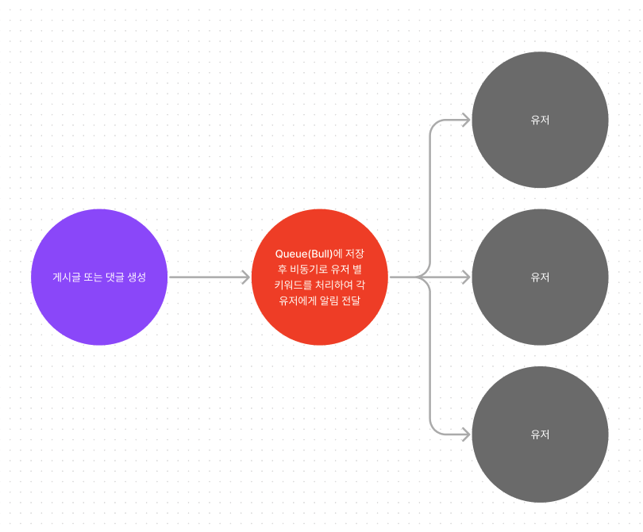

## Stack
- nodejs
- nestjs
- mysql
- redis
- liquibase
- docker
- swagger

## Installation
1. 도커 이미지 실행
```bash
$ yarn docker:up
```

2. 서비스 실행
- 실행 후 docker에 모든 자원은 실행되었지만 liquibase를 통해 모든 스키마 및 mocking 데이터가 생성되므로 1분 ~ 2분 정도 더 기다리신 후 확인하실 수 있습니다.
```bash
$ yarn service:up
```

3. 서비스 종료
```bash
$ yarn service:down
```

## Description
- host: localhost
- port: 3000
- docs: /api

## 키워드 알림 서비스 로직


위 이미지처럼 댓글 또는 게시글 작성 시 Queue에 추가하고
각 consumer를 통해 알림을 처리하도록 구현
